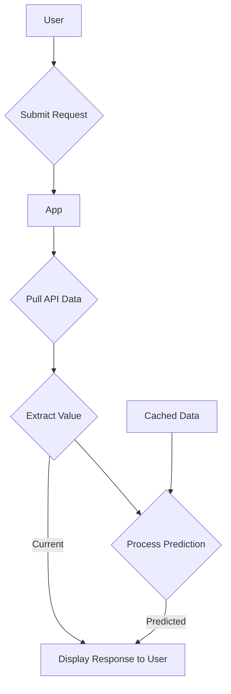

# RowFlow

## User Requests

This app allows the user to request the Thames River flow rates and water levels at a pre-specified location in order to determine if the water is safe to row on.

When the user submits their request, the App performs an API query to pull relevant records from the Environment Agency public data set and will then display a message to the user depending upon whether the values received are within preset safe limits or not.

The app also pulls data on a daily basis and caches it. It applies Machine Learning to this data to predict the daily maxima levels over the forthcoming period, and will alert the user if unsafe levels are expected.

## Process Flow



## Prediction Validation Analysis

The app uses Machine Learning tools to make predictions about upcoming river conditions. As this process does not use a previously validated prediction mechanism, functionality is included that allows the predictions made by the app to be compared with corresponding actual values.

This is achieved by storing the predicted data when it is generated and comparing it to the actual daily maxima for the corresponding dates (as and when it becomes available). A chart is displayed to the user showing these actual values (per day) against the values predicted. Since the user might make several requests to the app for data during overlapping predictions periods, the minimum and maximum predictions per day will be included in the output.

## Architecture

The App is hosted within the Azure cloud service and exclusively uses serverless components, particularly Azure Container Apps running Python-based containers. All resource to resource authentication is handled via managed identities.

CosmosDB is used to cache the predictions data, which itself is generated using the Automated ML feature within the Azure Machine Learning service.
 
## Testing Strategy

Testing will be included to cover the following aspects of the app design and implementation:

### Unit Tests

* Python's built-in `unittest.mock` module can be used to test the core functionality against mocked API endpoints.

### Code Scanning & Static Analysis

* GitHub CodeQL can be used to perform static analysis to find vulnerabilities and errors in the app code.

* SonarCloud/SonarQube can be also being considered to perform the same role.

### End to End testing

* Playwright can be used to simulate user actions and test the end to end functionality of the app.

## Further ideas

Use event driven architecture to facilitate data flow.

## References

Environment Agency APIs:

[Real-time API reference](https://environment.data.gov.uk/flood-monitoring/doc/reference#readings)

[Monitoring Station data (Kingston upon Thames)](https://environment.data.gov.uk/flood-monitoring/id/stations/3400TH)

[Monitoring station data endpoint](https://environment.data.gov.uk/flood-monitoring/id/stations/3400TH/readings?startdate=2025-06-27&_sorted)

Azure Machine Learning Tools:

[Set up AutoML to train a time-series forecasting model with SDK and CLI](https://learn.microsoft.com/en-us/azure/machine-learning/how-to-auto-train-forecast?view=azureml-api-2&tabs=python)

Testing Tools:

## Local Build and Run Instructions

### To run locally (without Docker)

Navigate to the app directory:

```bash
cd ./application/rowflow
```

Create a virtual environment:

```bash
python3 -m venv venv
```

Activate it:

```bash
source venv/bin/activate
```

Install dependencies:

```bash
pip install -r requirements.txt
```

Run the app:
```bash
python app.py
```

Open:

```bash
http://127.0.0.1:5000/
```

### To build and run with Docker:

Make sure Docker Desktop is running.

Navigate to app code directory in terminal.

Build the Docker image:

```bash
docker build -t rowflow .
```

Run the Docker container:

```bash
docker run -p 5000:5000 rowflow
```

Open:

```bash
http://127.0.0.1:5000/
```
